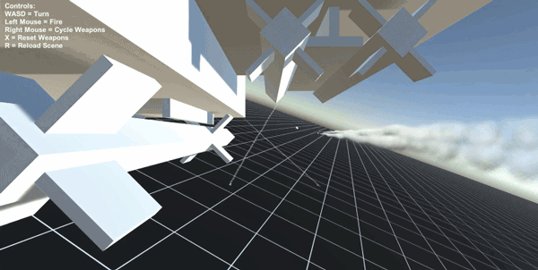
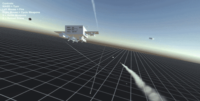
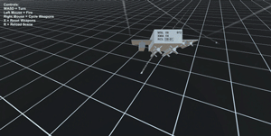
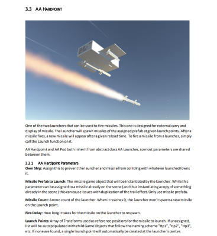

# AceArcadeMissiles
Arcade style missile code, effect, and sound pack.

## Download
**[Both the playable demo and standalone package can be found on the Releases page](https://github.com/brihernandez/AceArcadeMissiles/releases/)**

## Features
Ace Arcade Missiles is a complete code and effects package for creating arcade style missiles.
- Detailed documentation for reference
- Two kinds of guidance: Pure pursuit and Lead
- Support for both Update and FixedUpdate based projects
- Many tweakable missile parameters such as seeker cone, motor acceleration, and turn rate
- Missiles can be set with a delayed activation to allow dropping before firing
- Effects manager that handles both ribbon trails and particle system trails, as well as explosions
- Spawned effects (trails and explosions) automatically clean themselves up
- Audio is handled automatically when assigned an audio clip with adjustable parameters
- Two types of missile launchers: Pod and Hardpoint
- Hardpoints can carry missiles externally, while pods launch from user defined tubes with reloadable magazines
- Pack includes example effects for particle and ribbon trails, basic sound effects, and explosions

## Manual

The full manual can be found in the [Assets/AceArcadeMissiles/Documentation](Assets/AceArcadeMissiles/Documentation/Manual) folder.
